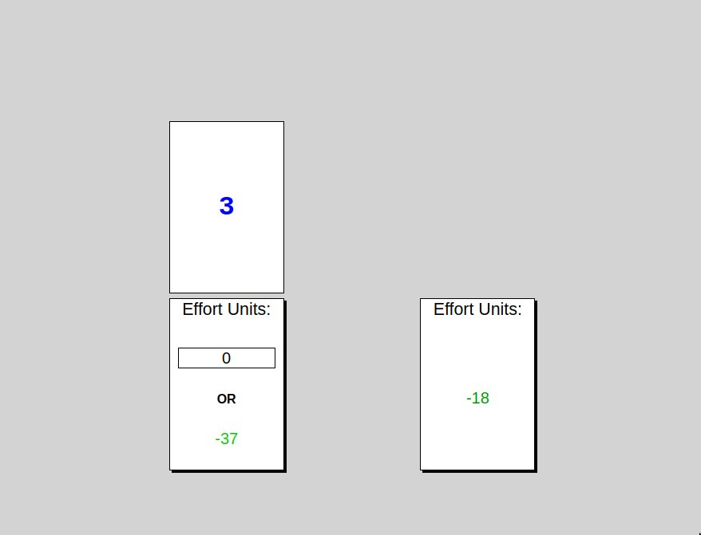

# Risky Demand Selection Task

This repository contains the source code for the version of the demand selection task (originally developed by [Wouter Kool and colleagues](https://psycnet.apa.org/doi/10.1037/a0020198)) incorporating risk into choice. 

The experiment is hosted at: https://davebraun.net/dissertation/experiments/production/exp3

The experiment is broken down into three general phases, the code for which can be found at the following:  

* `experiment/pracCued/index.html`  
* `experiment/dst/index.html`  
* `experiment/rapidFire/index.html`

Custom JavaScript functions are found in `experiment/js/exp3Functions.js` and
`globalJs/globalFunctions.js`.

## Data saving

Saving data as I've implemented it in this experiment relies on hosting the
experiment on a server that supports [common gateway
interface (CGI)](https://stackoverflow.com/questions/2089271/what-is-common-gateway-interface-cgi).
You need to make an AJAX call in your JS to a Python (or some other language)
CGI script (usually located in the `~/cgi-bin` directory on the server), and the
CGI script will write the data to the server. See an excellent tutorial by Tim
Brady on how to set all that up [here](https://bradylab.ucsd.edu/ttt/).
