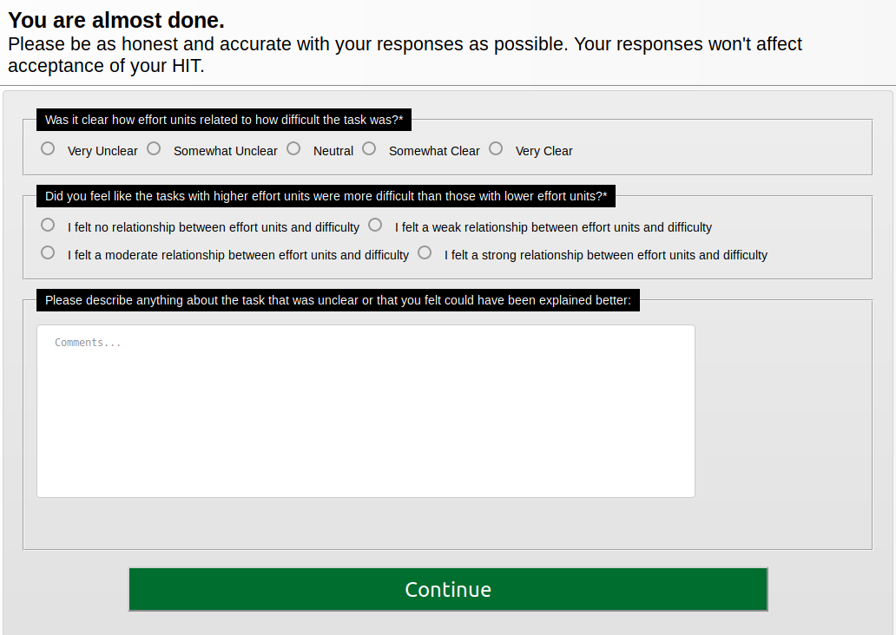

```{r include = FALSE}
library(tidyverse)
```


*This document was last updated at `r Sys.time()`.*

This document is dedicated to conducting a descriptive summary of the survey data from the Experiment 3 pilot. Briefly, this pilot was conducted mostly to assess the clarity of instructions. **Nine subjects were recruited for the pilot.** The survey that was given to subjects can be seen below:  



## Results

```{r}
d <- read.csv('../../data/demo.csv')
```

### Was it clear how effort units related to how difficult the task was?

```{r warning = FALSE}
d$clarity <- factor(d$clarity, levels = rev(c('very-clear', 'somewhat-clear', 'neutral', 'somewhat-unclear', 'very-unclear')))
d$unitFeel <- factor(d$unitFeel, levels = c('no-relationship', 'weak', 'moderate', 'strong'))
ggplot(d, aes(x = clarity)) +
  geom_histogram(stat = 'count', fill = 'light grey', color = 'black') +
  scale_x_discrete(drop = FALSE, labels = c(`very-clear` = 'Very Clear', `somewhat-clear` = 'Somewhat Clear', `neutral` = 'Neutral', `somewhat-unclear` = 'Somewhat Unclear', `very-unclear` = 'Very Unclear')) +
  labs(
    x = 'Clarity', 
    y = 'Count'
  ) + 
  theme_bw()
```


### Did you feel like the tasks with higher effort units were more difficult than those with lower effort units?

```{r warning = FALSE}
ggplot(d, aes(x = unitFeel)) +
  geom_histogram(stat = 'count', fill = 'light grey', color = 'black') +
  scale_x_discrete(drop = FALSE, labels = c(`no-relationship` = 'No Relationship', `weak` = 'Weak', `moderate` = 'Moderate', `strong` = 'Strong')) +
  labs(
    x = 'Feel of Units Tied to Difficulty', 
    y = 'Count'
  ) + 
  theme_bw()
```


### Open comments

```{r}
for (row in 1:(nrow(d))) {
  print(paste('Subject ', row, ':', sep=''))
  print(toString(d[row,]$comments))
  print('')
}
```


